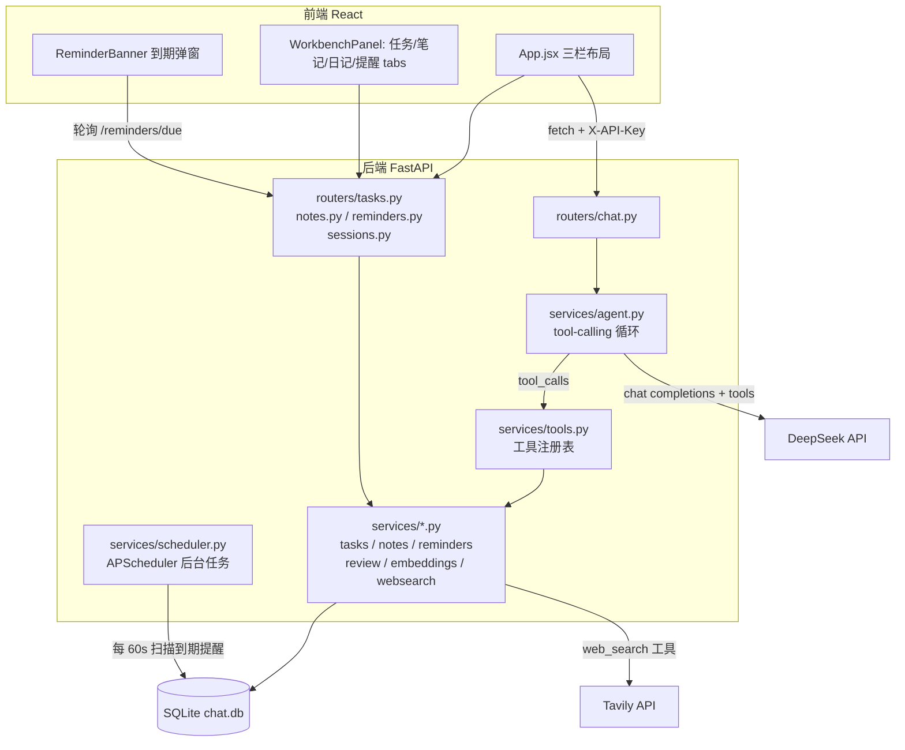

# AI-Chat 技术架构文档

> 面向：项目维护者本人 + 未来接手这个仓库的其他 AI / 开发者。
> 目标：不用通读全部源码，看完这一篇就能理解整体架构、每个文件的职责、怎么加新功能。

## 1. 项目是什么

一个基于 DeepSeek API 的**个人工作台 agent 平台**。表面上是个聊天应用，但聊天只是入口——背后是任务管理、笔记知识库（语义检索）、日记复盘、日程提醒、联网搜索几个模块，AI 通过 **function calling** 真实地操作这些模块的数据，而不是纯文本问答。

演进路径（有历史包袱，理解代码时有用）：
1. 最初是纯聊天机器人（存历史、多轮对话）
2. 加固了安全/工程基础（CORS 白名单、API Key 鉴权、同步 DB → 异步 DB、模型迁移）
3. 改造成 agent 平台：核心 tool-calling 循环 + 5 个功能模块分阶段接入

## 2. 技术栈总览

| 层 | 技术 | 说明 |
|---|---|---|
| 后端框架 | FastAPI (0.14x) | 全异步路由 |
| ASGI Server | Uvicorn | |
| ORM | SQLAlchemy 2.0（`sqlalchemy.ext.asyncio`） | 全异步 |
| 数据库驱动 | aiosqlite | SQLite 的异步驱动 |
| 数据库 | SQLite（单文件 `chat.db`） | 个人规模项目，没有上独立数据库服务 |
| LLM | DeepSeek API（`deepseek-flash` 模型），OpenAI SDK 兼容协议 | `AsyncOpenAI(base_url="https://api.deepseek.com")` |
| Embedding | fastembed（本地 ONNX 模型 `BAAI/bge-small-zh-v1.5`，512 维） | 不依赖外部 embedding API |
| 向量检索 | 暴力余弦相似度（Python 手写，`numpy`） | 没有上向量数据库，见"已知限制" |
| 后台调度 | APScheduler（`AsyncIOScheduler`） | 提醒到期扫描 |
| 联网搜索 | Tavily REST API（用 `httpx` 直接调用，没用 SDK） | |
| 前端框架 | React 19 + Vite 8 | 无状态管理库，纯 `useState`/props |
| Markdown 渲染 | react-markdown | 渲染 AI 回复 |
| 部署 | Railway（后端）+ Vercel（前端） | |
| Python 版本 | 3.11（`.python-version`） | 曾经是 Anaconda 全局 3.8，因为 `fastembed` 依赖的 `onnxruntime` 需要 3.10+ 而升级 |

## 3. 系统架构



**一次带工具调用的对话请求的完整链路**（以 `/api/chat/stream` 为例）：

1. 前端 `sendMessage()` 发 POST，带 `X-API-Key` header
2. `services/auth.py` 的 `verify_api_key` 依赖校验 key
3. `routers/chat.py` 把用户消息存库，拼装 system prompt（含当前时间）+ 历史消息
4. `services/agent.py::run_agent()` 进入循环：调用 DeepSeek `chat.completions.create(tools=...)`，如果返回 `tool_calls` 就执行对应工具（`services/tools.py` 里查表分发到 `services/tasks.py` / `notes.py` / `reminders.py` / `review.py` / `websearch.py`），把结果塞回对话继续问，直到模型不再要求调用工具
5. 每一步（工具调用/结果/最终回复）写进 `agent_traces` 表，用于可观测性
6. 拿到最终文本后，`routers/chat.py` 把它切成小块、带小延迟依次 yield 给前端，模拟打字机效果（**注意：这不是真正的 token 级流式**，因为工具调用阶段无法边调用边流式吐字，所以是"整体生成完再回放"）
7. 响应头带 `X-Session-Id`（新会话 id）和 `X-Tool-Used`（这轮有没有调用过工具），前端用后者决定要不要刷新工作台面板

## 4. 目录结构与文件职责

```
AI-Chat/
├── main.py                    # FastAPI 入口：CORS 白名单、lifespan（建表+启动调度器）、挂路由
├── database.py                # 所有 SQLAlchemy 模型 + 异步 engine/session 工厂
├── requirements.txt           # 后端依赖（注意 numpy/onnxruntime 有版本钉住，见下）
├── .python-version            # 3.11，配合 Railway 部署用
├── vercel.json                # 让 Vercel 在 monorepo 里正确构建 frontend/ 子目录
├── railway.toml                # Railway 启动命令
│
├── routers/                   # 只做「解析请求 → 调 services → 序列化响应」，不写业务逻辑
│   ├── chat.py                # /api/chat, /api/chat/stream —— agent 对话入口，system prompt 在这里拼
│   ├── sessions.py            # /api/sessions —— 会话/消息历史查询
│   ├── tasks.py                # /api/tasks —— 任务 CRUD REST
│   ├── notes.py                # /api/notes —— 笔记/日记 CRUD + 语义搜索 REST
│   └── reminders.py           # /api/reminders —— 提醒 CRUD REST
│
├── services/                  # 业务逻辑层，REST 路由和 agent 工具共用同一套函数（不重复实现）
│   ├── auth.py                 # X-API-Key 鉴权依赖，自己调用 load_dotenv()（不依赖别的模块先加载 .env）
│   ├── llm.py                  # DeepSeek 客户端封装：ask_deepseek / ask_deepseek_stream / ask_deepseek_with_tools
│   ├── agent.py                 # ★ 核心：ReAct 风格 tool-calling 循环，写 agent_traces
│   ├── tools.py                 # ★ 工具注册表：每个工具的 JSON Schema + handler 函数，agent.py 靠这个分发
│   ├── tasks.py                 # 任务 CRUD（纯数据库操作，无 LLM 调用）
│   ├── notes.py                 # 笔记/日记 CRUD + create_journal_entry + 语义检索（暴力余弦相似度）
│   ├── embeddings.py            # fastembed 封装：embed_text（线程池跑推理，不阻塞事件循环）、cosine_similarity
│   ├── review.py                # 周复盘数据聚合（只出数据，不调 LLM，总结交给 agent 自己写）
│   ├── reminders.py             # 提醒 CRUD + mark_due_as_fired（供调度器调用）
│   ├── scheduler.py             # APScheduler 封装：每 60s 跑一次到期扫描
│   └── websearch.py             # Tavily REST 封装，没配 key 时优雅降级返回错误提示而不是抛异常
│
└── frontend/                   # React + Vite，见第 11 节
```

## 5. 核心机制：Agent Tool-Calling 循环

`services/agent.py::run_agent(db, session_id, turn_index, messages)`：

```python
for step in range(MAX_STEPS):  # MAX_STEPS = 5，防止死循环
    message = await ask_deepseek_with_tools(conversation, TOOL_SCHEMAS)
    if not message.tool_calls:
        return message.content, trace   # 模型给出最终回复，循环结束
    # 否则：模型要求调用一个或多个工具
    for call in message.tool_calls:
        handler = TOOL_HANDLERS[call.function.name]
        result = await handler(db, json.loads(call.function.arguments))
        conversation.append({"role": "tool", "tool_call_id": call.id, "content": json.dumps(result)})
        # 每一步都写进 agent_traces 表
```

设计要点（面试/自己回顾时有用）：
- **工具是服务层的薄包装**：`services/tools.py` 里的 handler 只是调用 `services/tasks.py` 等模块的普通函数，REST 路由也调用同一套函数——聊天里能做的事和界面上能做的事逻辑不分叉
- **工具本身是"哑"的，不调用 LLM**：比如 `get_weekly_review` 只返回结构化数据，总结文字是外层 agent 循环自己生成的，这样工具是确定性的、可单测的
- **system prompt 里注入当前时间**（`routers/chat.py::_build_system_prompt()`），否则模型没法把"明天""5分钟后"这种相对时间换算准
- **流式接口不是真流式**：见第 3 节最后一条

## 6. 数据模型（`database.py`）

| 表 | 关键字段 | 用途 |
|---|---|---|
| `sessions` | id, title, created_at | 一次对话会话 |
| `messages` | id, session_id, role, content, created_at | 每条消息（原始对话历史，agent 内部的工具调用过程不存在这里，存在 `agent_traces`） |
| `tasks` | id, title, done, due_at, created_at, updated_at | 任务/待办 |
| `notes` | id, title, content, **category**('note'\|'journal'), embedding(JSON 数组文本), created_at | 笔记和日记复用同一张表，靠 category 区分；`embedding` 是 fastembed 生成的 512 维向量，序列化成 JSON 字符串存 |
| `reminders` | id, message, remind_at, **fired**(bool), created_at | `fired` 由 `services/scheduler.py` 的后台任务在到期后置 True，前端据此弹提示 |
| `agent_traces` | id, session_id, turn_index, step_index, type('tool_call'\|'tool_result'\|'final'), name, payload(JSON), created_at | 每轮对话内 agent 的完整执行轨迹，用于可观测性/调试 |

`init_db()` 用 `Base.metadata.create_all`，没有用 Alembic 做迁移——加字段/改表结构目前只能手动处理或删库重建。

## 7. Agent 工具清单

全部定义在 `services/tools.py` 的 `TOOLS` 列表里，每个工具 = JSON Schema（给模型看）+ handler 函数：

| 工具名 | 作用 | 对应 service |
|---|---|---|
| `create_task` | 建任务，可选截止时间 | `tasks.create_task` |
| `list_tasks` | 查任务（全部/未完成/已完成） | `tasks.list_tasks` |
| `complete_task` | 标记完成 | `tasks.complete_task` |
| `delete_task` | 删除 | `tasks.delete_task` |
| `save_note` | 存笔记（自动算 embedding） | `notes.create_note` |
| `search_notes` | 语义检索笔记 | `notes.search_notes` |
| `add_journal_entry` | 记日记（category='journal'，标题自动生成"日记 YYYY-MM-DD"） | `notes.create_journal_entry` |
| `get_weekly_review` | 拿近 7 天任务/日记/笔记的聚合数据（不生成总结） | `review.get_weekly_review` |
| `set_reminder` | 设提醒 | `reminders.create_reminder` |
| `list_reminders` | 查所有提醒 | `reminders.list_reminders` |
| `cancel_reminder` | 取消提醒 | `reminders.cancel_reminder` |
| `web_search` | 联网搜索（Tavily），没配 key 时返回错误提示 | `websearch.web_search` |

## 8. REST API 一览

除 `/api/chat*` 外，其余接口主要是给前端直接操作数据用的（不经过 agent），全部需要 `X-API-Key` header。

| Method | Path | 说明 |
|---|---|---|
| POST | `/api/chat` | 非流式对话，返回 `{session_id, reply, trace}` |
| POST | `/api/chat/stream` | 流式对话（伪流式，见第 3 节），响应头 `X-Session-Id` / `X-Tool-Used` |
| GET | `/api/sessions` | 会话列表 |
| GET | `/api/sessions/{id}/messages` | 某会话的历史消息 |
| GET/POST | `/api/tasks` | 任务列表/新建 |
| PATCH | `/api/tasks/{id}/complete` | 标记完成 |
| DELETE | `/api/tasks/{id}` | 删除 |
| GET/POST | `/api/notes` | 笔记列表（`?category=note\|journal`）/新建 |
| GET | `/api/notes/search` | 语义搜索（`?query=&top_k=&category=`） |
| DELETE | `/api/notes/{id}` | 删除 |
| GET/POST | `/api/reminders` | 提醒列表/新建 |
| GET | `/api/reminders/due` | 已到期（`fired=true`）的提醒，前端轮询用 |
| DELETE | `/api/reminders/{id}` | 取消/dismiss |

## 9. 鉴权与安全

- **API Key**：所有 `/api/*` 路由挂 `Depends(verify_api_key)`（`services/auth.py`），校验请求头 `X-API-Key` 是否等于环境变量 `API_KEY`。**注意**：`API_KEY` 未设置时鉴权直接放行（方便本地开发），生产环境必须设置。
- **前端的 key 不是真正的密钥**：`VITE_*` 环境变量会被 Vite 打包进最终 JS，浏览器 devtools 能直接看到。这层鉴权只能挡住随手扫描/滥用，挡不住"真想扒接口的人"。真要防刷额度还需要加 rate limiting（目前没做）。
- **CORS 白名单**：`main.py` 里 `allow_origins` 默认只允许 `localhost:5173` 和线上 Vercel 域名，可用 `ALLOWED_ORIGINS` 环境变量（逗号分隔）覆盖。

## 10. 环境变量（`.env`，已 gitignore）

| 变量 | 必需 | 说明 |
|---|---|---|
| `DEEPSEEK_API_KEY` | 是 | DeepSeek API key |
| `API_KEY` | 建议 | 前后端之间的简单鉴权 key，前端对应 `VITE_API_KEY`（同一个值） |
| `ALLOWED_ORIGINS` | 否 | 逗号分隔的允许跨域来源，不设则用代码里的默认值 |
| `TAVILY_API_KEY` | 否 | 不设置时 `web_search` 工具会返回"未配置"错误，不影响其他功能 |

前端对应 `frontend/.env`：
| 变量 | 说明 |
|---|---|
| `VITE_API_KEY` | 必须和后端 `API_KEY` 一致 |

## 11. 前端结构

```
frontend/src/
├── main.jsx              # 入口，挂载 App
├── App.jsx               # 顶层布局：会话侧栏 / 聊天区 / WorkbenchPanel 三栏 + 顶部 ReminderBanner
├── api.js                # 导出 API base URL + authHeaders，所有组件从这里引用
├── theme.js              # 共享的颜色/输入框/按钮内联样式常量（没用 CSS 框架，纯 inline style）
└── components/
    ├── WorkbenchPanel.jsx   # 右侧面板的 tab 容器（任务/笔记/日记/提醒四个 tab）
    ├── TaskPanel.jsx        # 任务 tab 内容：增删改
    ├── NotePanel.jsx        # 笔记/日记共用（category prop 区分），含语义搜索框
    ├── ReminderPanel.jsx    # 提醒管理：列表 + 手动创建 + 取消
    └── ReminderBanner.jsx   # 顶部到期提醒弹窗，轮询 /reminders/due
```

状态管理：没有 Redux/Zustand，纯 `useState` + props 下钻。`App.jsx` 里的 `workbenchRefreshKey` 是个计数器，agent 用过工具后 `+1`，通过 props 传给各面板触发它们重新 fetch——这是让"聊天里改的数据"和"面板上看到的数据"保持一致的机制。

前端目前是通过 `git subtree` 从独立仓库 `ai-chat-frontend` 合并进来的（保留了原始提交历史），原仓库已加归档说明。

## 12. 本地开发

```bash
# 后端（注意用 3.10+ 的 Python，本机用的是 D:\python\python.exe / py -3.10）
py -3.10 -m venv .venv
./.venv/Scripts/pip install -r requirements.txt
# .env 里配好 DEEPSEEK_API_KEY 等变量
./.venv/Scripts/python.exe -m uvicorn main:app --reload

# 前端
cd frontend
npm install
# .env 里配 VITE_API_KEY
npm run dev
```

## 13. 部署

- **后端 Railway**：`railway.toml` 指定启动命令 `uvicorn main:app --host 0.0.0.0 --port $PORT`。需要在 Railway 项目里配好 `.env` 里的那几个环境变量，并确认用的是 Python 3.11（`.python-version` 应该会被识别）。
- **前端 Vercel**：仓库是 monorepo（`frontend/` 子目录），`vercel.json`（仓库根目录）显式指定 `cd frontend && npm install/build`，产物在 `frontend/dist`，这样不依赖 Vercel 项目设置里的 Root Directory 配置也能构建。

## 14. 已知限制 / 技术债

- **`onnxruntime==1.17.3` + `numpy<2` 是刻意钉死的版本**：更高版本的 onnxruntime 在这台开发机上和 numpy 2.x 有 ABI 冲突，会直接导致进程崩溃（不是 Python 异常，是原生层面的崩溃）。升级前先确认这个组合还兼容。
- **语义检索是暴力余弦相似度**，笔记量级到几千条以上会明显变慢，需要的话换成 `sqlite-vec` 或独立向量库。
- **流式接口是"伪流式"**（先跑完 agent 循环，再把结果切块回放），工具调用阶段完全不可见给用户，只能等。
- **没有分页**：`/api/sessions`、`/api/notes` 等接口全量返回，数据量大了会慢。
- **没有自动化测试**，所有验证都是手动 curl / 浏览器测试。
- **单用户设计**：没有多用户/多租户概念，`API_KEY` 是全局共享的一把钥匙。
- **`web_search` 工具返回的网页内容没有做 prompt injection 防护**：如果网页里藏着"忽略之前的指令"这类内容，理论上有被注入的风险，目前没有针对性处理。
- **提醒的到期通知只有前端轮询弹窗**，没有推送/邮件/短信，用户必须开着页面才能看到。

## 15. 可能的后续方向

- 多 agent 编排（router agent 分发给专门的子 agent）
- 评测 harness（一组测试 prompt + 预期工具调用，自动化跑分）
- 向量检索升级到专门的向量库
- rate limiting 防止 API 被刷
- Alembic 数据库迁移
