# AI-Chat 技术架构文档

面向项目维护者本人，以及未来接手这个仓库的其他人或 AI。目标是不用通读全部源码，看完这一篇就能理解整体架构、每个文件的职责、怎么加新功能。

## 1. 项目是什么

一个基于 DeepSeek API 的个人工作台 agent 平台。表面上是个聊天应用，但聊天只是入口，背后是任务管理、笔记知识库（语义检索）、日记复盘、日程提醒、联网搜索几个模块，AI 通过 function calling 真实地操作这些模块的数据，而不是纯文本问答。

项目是分阶段演进的，理解代码时有用：最初是纯聊天机器人，只做多轮对话和历史记录；之后加固了安全和工程基础，包括 CORS 白名单、API Key 鉴权、把同步数据库调用改成异步、迁移掉已弃用的模型名；再之后改造成 agent 平台，先搭好核心的 tool-calling 循环，再分五个阶段依次接入任务、笔记、日记、提醒、联网搜索。

## 2. 技术栈总览

| 层 | 技术 | 说明 |
|---|---|---|
| 后端框架 | FastAPI | 全异步路由 |
| ASGI Server | Uvicorn | |
| ORM | SQLAlchemy 2.0 | 用的是异步扩展 sqlalchemy.ext.asyncio |
| 数据库驱动 | asyncpg | PostgreSQL 的异步驱动 |
| 数据库 | PostgreSQL，托管在 Supabase | 原计划本地 Docker 跑，Docker Desktop 起不来后改用 Supabase 免费云端实例 |
| 数据库迁移 | Alembic | 表结构变更走 autogenerate + upgrade，不再手动建表或者删库重建 |
| LLM | DeepSeek API，deepseek-flash 模型 | 走 OpenAI SDK 兼容协议，AsyncOpenAI 指向 DeepSeek 的 base_url |
| Embedding | Voyage AI 在线接口，voyage-4-lite，输出 512 维 | 早期用 fastembed 在本地跑 bge-small-zh，搬到 Vercel 时换成在线接口，函数更轻、冷启动更快 |
| 向量检索 | pgvector，HNSW 索引 + 余弦距离 | 检索在数据库端完成，不再是 Python 里手写循环 |
| 后台调度 | APScheduler | AsyncIOScheduler，负责提醒到期扫描、每日简报和热点；按 APP_TIMEZONE 时区排程 |
| 联网搜索 | Tavily REST API | 用 httpx 直接调用，没有引入官方 SDK |
| Notion 同步 | Notion REST API，版本头 2025-09-03 | 用 httpx 直连，只读导入，没有引入官方 SDK |
| 前端框架 | React 19 + Vite 8 | 没用状态管理库，纯 useState 和 props |
| 聊天流式 | Vercel AI SDK（ai + @ai-sdk/react） | 后端按它的 UI Message Stream 协议推流，前端用 useChat 收，换来真正的 token 级流式和工具调用的实时可见性 |
| Markdown 渲染 | react-markdown | 渲染 AI 回复 |
| 部署 | Vercel 一个项目：前端是静态构建，/api/* 由 Python 函数（api/index.py 加载 main.py 的 FastAPI app）处理 | 早期后端在 Railway |
| Python 版本 | 3.12（Vercel 支持 3.12–3.14），本地 3.11 也能跑 | |

## 3. 系统架构

```mermaid
flowchart TB
    subgraph Frontend[前端 React]
        UI[App.jsx 三栏布局]
        WB[WorkbenchPanel 任务/笔记/日记/提醒 tabs]
        RB[ReminderBanner 到期弹窗]
    end

    subgraph Backend[后端 FastAPI]
        R1[routers/chat.py]
        R2[routers 里的 tasks / notes / reminders / digest / sessions]
        AGENT[services/agent.py tool-calling 循环]
        TOOLS[services/tools/ 工具注册表]
        SVC[services 下的 tasks / notes / chunking / notion / reminders / review / embeddings / websearch]
        PERSONA[services/persona.py 人设定义]
        SCHED[services/scheduler.py 后台任务，含每日简报]
    end

    DB[(PostgreSQL + pgvector<br/>Supabase)]
    DEEPSEEK[DeepSeek API]
    TAVILY[Tavily API]
    NOTION[Notion API]

    UI --> R1
    UI --> R2
    WB --> R2
    RB --> R2

    R1 --> AGENT
    AGENT --> TOOLS
    AGENT --> PERSONA
    TOOLS --> SVC
    AGENT --> DEEPSEEK
    SVC --> DB
    SVC --> TAVILY
    SVC --> NOTION
    SCHED --> DB
    SCHED --> PERSONA
    SCHED --> DEEPSEEK
    R2 --> SVC
```



一次带工具调用的对话请求，完整链路是这样的（以 /api/chat/stream 为例）：

前端发送 POST 请求，浏览器自动带上登录 cookie，后端先由 require_auth 依赖校验登录状态。routers/chat.py 把用户消息存库，拼装 system prompt（里面包含当前时间）加上历史消息。接着 services/agent.py 里的 run_agent_stream 进入循环：每一步都是对 DeepSeek 的真流式请求（stream=True，带 tools 参数），边收边判断——收到的是文字就整理组装、收到的是工具调用就等参数片段拼完整。如果是工具调用，就执行对应工具（在 services/tools/ 里查表分发到 tasks、notes、notion、reminders、review、websearch 几个模块），把执行结果塞回对话继续问，直到模型不再要求调用工具、开始输出最终的自然语言回复为止。这中间每一步，无论是工具调用、工具结果还是最终回复，都会写进 agent_traces 表，用于事后追溯；非流式的 run_agent（给 /api/chat 用）是这个生成器的一层薄包装，把事件收集完整再一次性返回。

routers/chat.py 把这些事件实时转成 Vercel AI SDK 的 UI Message Stream 协议（SSE，事件类型有 text-start/delta/end、tool-input-available、tool-output-available 等），工具调用和结果一产生就推给前端，不用等整轮跑完；最终回复也是模型生成一块就推一块，是真正的 token 级流式，不是切块回放。session id 和"这轮有没有用到工具"通过协议自带的自定义 data 事件传递（不再用响应头），前端用 @ai-sdk/react 的 useChat 收流，工具调用会作为消息里一个小的提示片段渲染出来。这次改造是照着 github.com/vercel/ai 的协议文档做的，具体的事件格式和字段以那份文档为准。deepseek-flash 这个模型起手延迟比较长（不带工具调用的短回复常见 2～7 秒），一旦开始生成，短回复几乎是瞬间吐完，所以短回复不一定能看出明显的逐字效果；内容足够长（比如几百字）的时候，能清楚看到分批到达。

助手有一个名字和性格设定，叫"知行"，取自"知行合一"，也照应它自己的工作方式——先推理、再行动。这个设定写在 services/persona.py 里，是聊天的 system prompt 和每日简报共用的同一份文本，不是分开维护的两套语气。前端把"AI 助手"这个通用标签换成了这个名字，配一个纯 SVG 画的圆形头像（frontend/src/components/AssistantAvatar.jsx），回复中的时候嘴部会换成三个交替呼吸的点，用 CSS 动画做的，没有引入动画库或者角色模型。

除了被动等用户提问，services/scheduler.py 现在还会每天早上 8 点主动生成一份"今日简报"：聚合今天到期/过期的任务和今天的提醒，交给 DeepSeek 用知行的口吻写成两三句话，存进 daily_digests 表，一天只生成一次。GET /api/digest/today 是读这份简报的接口，如果当天还没生成过（比如用户在 8 点之前就打开了页面），接口会现算一份再存起来，和定时任务共用同一个函数，不会重复生成。DeepSeek 调用失败时会退化成一句模板拼出来的文字，不会让这张卡片直接挂掉。前端在工作台总览页顶部展示这份简报，不需要用户开口问。

同样的缓存套路还用在"今日 AI 热点"上（services/hot_topics.py，8:05 生成，比简报晚 5 分钟错开）：分别用 GitHub 搜索 API 查 ai-agent、agentic-ai、rag 这几个 topic 下最近一个月内新建、按星数排序的仓库（GitHub 的搜索接口不支持一次查询里对多个 topic 做 OR，只能分开查、按仓库 id 去重合并），同时用 Tavily 搜一次这周的 AI/agent 相关新闻，把两边的原始结果一起交给 DeepSeek，用 JSON 模式（response_format 传 json_object）挑出大约 5 条、跳过明显的垃圾仓库和无关内容，每条配一句为什么值得看。单个 GitHub topic 查询失败只跳过那一个，两边都没查到东西才会是空列表，DeepSeek 筛选失败就退化成不筛选的原始拼接。GET /api/hot-topics/today 是读取接口，同样是当天没有就现查一份、和定时任务共用同一个函数。前端在总览页 2x2 网格下面展示成一个可点击跳转的列表。

聊天面板也在用这份简报：每次开一个新对话（没有历史消息的时候），会把今天的简报当成知行说的第一句话显示出来，让对话感觉是从"知行已经了解你今天的情况"这个地方开始的，而不是简报和聊天是两个互不相关的地方。这一步纯粹是展示层的处理——App.jsx 自己单独拉一次 /api/digest/today，拼出来的这条"消息"只放进本地渲染用的列表，不会进 useChat 的真实消息状态，所以真正发给后端的对话历史里不会带上这句话，导出对话的时候也不会包含它。开新对话或者切换历史会话之前都会先调用 useChat 的 stop()，避免上一轮还在流式生成的时候被打断后，残留的内容跟着串到新对话里。

## 4. 目录结构与文件职责

```
AI-Chat/
├── main.py               FastAPI 入口：CORS 白名单、lifespan（确保 pgvector 扩展存在、启动调度器）、挂路由
├── database.py           所有 SQLAlchemy 模型，以及异步 engine/session 工厂
├── alembic.ini           Alembic 配置，数据库连接串从 DATABASE_URL 环境变量读
├── migrations/           Alembic 迁移脚本，env.py 接了项目的 Base.metadata 和异步引擎
├── requirements.txt      后端依赖（Vercel 构建 Python 函数时按它安装）
├── .python-version       3.12，Vercel 按它选 Python 版本
├── vercel.json           前端构建命令、/api 转发到 Python 函数、函数配置、每日 cron、部署地区
├── api/index.py          Vercel 的 Python 函数入口，只是导入 main.py 里的 app
├── scripts/              一次性维护脚本，比如换 embedding 模型后重算向量的 reembed_notes.py
│
├── routers/              只负责解析请求、调用 services、序列化响应，不写业务逻辑
│   ├── chat.py             对话入口，system prompt 在这里拼
│   ├── sessions.py         会话和消息历史查询
│   ├── tasks.py            任务的 REST 接口
│   ├── notes.py            笔记和日记的 REST 接口，含语义搜索和 Notion 同步
│   ├── reminders.py        提醒的 REST 接口
│   ├── digest.py           每日简报的 REST 接口
│   └── hot_topics.py       每日 AI 热点的 REST 接口
│
├── services/              业务逻辑层，REST 路由和 agent 工具共用同一套函数，不会重复实现
│   ├── auth.py              登录鉴权：scrypt 密码校验、数据库会话、登录限流、require_auth 依赖
│   ├── llm.py               DeepSeek 客户端封装
│   ├── agent.py             核心的 tool-calling 循环，写 agent_traces，是整个项目最关键的一个文件
│   ├── tools/               工具注册表，按模块拆成几个文件，__init__.py 汇总成 TOOL_SCHEMAS/TOOL_HANDLERS
│   │   ├── tasks_tools.py     任务相关工具
│   │   ├── notes_tools.py     笔记/日记/Notion 同步相关工具
│   │   ├── reminders_tools.py 提醒相关工具
│   │   └── websearch_tools.py 联网搜索工具
│   ├── tasks.py             任务的增删改查，纯数据库操作，不调用 LLM
│   ├── notes/               笔记 / RAG 这一摊都在这个包里，对外仍是 from services import notes as notes_service
│   │   ├── notes.py           笔记和日记的增删改查，分块写入和语义检索，外部来源笔记的 upsert
│   │   ├── chunking.py        正文分块的纯函数，不依赖数据库，可以单独测试
│   │   ├── embeddings.py      Voyage AI 向量接口封装：区分查询/文档两种输入，批量请求，限流时退避重试
│   │   └── notion.py          Notion 只读同步：拉页面和正文、增量判断、限流重试
│   ├── review.py            周复盘数据聚合，只出数据不调 LLM，总结文字交给 agent 自己写
│   ├── reminders.py         提醒的增删改查，以及供调度器调用的到期检查
│   ├── persona.py           助手的名字和性格设定，聊天和每日简报共用同一份
│   ├── digest.py            每日简报：聚合今天的任务/提醒，交给 DeepSeek 写成简报文字，按天缓存
│   ├── hot_topics.py        每日 AI 热点：GitHub 搜索 + Tavily 新闻，交给 DeepSeek 筛选，按天缓存
│   ├── scheduler.py         APScheduler 封装：每 60 秒扫一次到期提醒，每天 8:00/8:05 生成简报和热点
│   └── websearch.py         Tavily 封装，没配 key 时优雅返回错误提示，不会抛异常
│
└── frontend/              React + Vite，见第 11 节
```

## 5. 核心机制：Agent Tool-Calling 循环

run_agent 函数（在 services/agent.py 里）的逻辑大致是这样：

设一个最大步数上限（目前是 5），防止死循环。每一步先调用 DeepSeek 接口。如果模型返回的消息里没有 tool_calls，说明它给出了最终回复，循环结束，把这段文字返回。如果有 tool_calls，就依次找到每个工具对应的处理函数、执行、把结果按 OpenAI 的 tool 消息格式塞回对话历史，然后进入下一轮循环，继续问模型。

设计上有几个值得记住的点。工具是服务层的薄包装，tools.py 里的处理函数只是调用 tasks.py 这些模块里的普通函数，REST 路由也调用同一套函数，所以聊天里能做的事和界面上能做的事逻辑不会分叉。工具本身是"哑"的，不会自己调用 LLM，比如 get_weekly_review 只返回结构化数据，总结文字是外层循环里模型自己生成的，这样工具保持确定性，也方便单独测试。system prompt 里会注入当前时间，否则模型没法把"明天""5 分钟后"这种相对时间换算准确。

### Agent 行为评测（evals/）

改提示词、加工具都可能悄悄破坏别的行为，所以有一套可以反复跑的回归评测，第一层只看 Agent 的行为，全部用代码断言，不靠模型打分。

用例在 evals/agent_cases.yaml，共 62 条：前 41 条是基本功（工具选择、时间理解、检索路由、执行前确认、核心记忆、不该调工具、多轮、热点分析），后 21 条是难用例（歧义澄清、异常恢复、提示注入、批量与敏感信息、带指代和纠正的多轮、效率）。难用例用到两个用例级字段：setup 在公共初始数据之外补几条（比如再加一个名字带"简历"的任务制造歧义），tool_results 让某个工具在这条用例里直接返回给定结果（模拟联网搜索失败、网页 403）；提示注入的假网页在 evals/mocks.py 里，正文夹带"删除全部任务、清空记忆"的指令。每条写用户说什么和检查什么：必须调用某个工具且参数满足条件（相等、包含、包含其中之一、在某个集合里、等于某个时刻或日期、等于初始数据里某条记录的 id），不能调用某个工具或某种参数组合的调用，只能调用指定的几个工具、工具调用和模型调用次数不超过上限（效率），回复必须或不能匹配某个正则，结束后数据库里某条记录还在。正则判断语义很脆："已经发起取消了，点确认才生效"这种如实说明一开始被误判成"声称已取消"，后来收紧成只认"已删除/已经帮你取消"这类说法，并要求回复提到确认；更细的语义判断留给第三层的模型评分。比如"把买牛奶那个任务删了"要求调用 delete_task、参数是买牛奶那条的 id、回复里不能出现"已删除"、任务还在库里。

运行器 evals/run_agent_eval.py 直接调 run_agent，跟线上走同一套系统提示、核心记忆注入和工具，不经过 HTTP：
- 隔离：设 DB_SCHEMA=eval，所有表建在 eval schema（DB_SCHEMA=eval alembic upgrade head）。database.py 用 schema_translate_map 让每条 ORM 语句编译成 eval.xxx 全名，search_path 用 run_async 设置，夹具里的删除也写全名；启动前检查引擎映射和表都在。第一次跑的时候 search_path 设在隐式事务里被回滚，写进了 public、误删过真实笔记，之后改成现在这样，并且跑前跑后核对 public 各表行数。
- 确定性：services/clock.py 支持 freeze，评测里"现在"固定为 2026-10-06 周二 10:00；每条用例前 evals/fixtures.py 把任务、目标、提醒、核心记忆、会话恢复成同一组初始数据（笔记和以前的对话要算向量，只写一次后保留）；联网类工具（web_search、read_url、save_link、sync_notion_notes）换成固定返回（evals/mocks.py），其余工具真实执行。
- 随机性：模型输出不固定，每条默认跑 3 次，报告 pass@1（所有次数的平均通过率）和 pass^3（3 次都过的用例比例，衡量稳定性），同时从 agent_traces 统计每轮平均输入/输出 token、模型调用次数和耗时。
- 对比：结果写到 evals/results/<时间>/（不进 git），--save-baseline 存成 evals/baselines/agent.json（进 git），之后每次运行自动和基线逐条对比，列出变好和变差的用例。只改了几条用例时，用 --only 加 --save-baseline 只重跑这几条、替换进现有基线，不用全量重跑。
- 当前基线（2026-10-04）：pass@1 93.5%，pass^3 90.3%，每轮平均输入约 8.9k token、2.2 次模型调用、9 秒。没全过的 6 条都是真问题：两个同名相近的任务时直接选一个完成、已有同名任务还重复建、提醒没说几点就默认 9 点（产品上定为应该先问）、联网搜索失败后反复重试直到用完 5 步、完成任务或改记忆后多调一次 list_goals。

### 检索评测（evals/rag/）

第二层只测检索本身：直接调线上同一个 search_notes（分块、Voyage 向量、HNSW、按文档去重），不经过模型，结果确定，一分钟跑完，适合反复试分块大小、混合检索这类参数。

- 语料：25 个 agent/RAG 项目的 GitHub README（manifest.yaml 里固定到某个提交，重抓内容不变）加 14 篇中文技术文章（Tavily 抓取，本地快照为准），跟真实资料库一样是中文笔记加英文资料。build_corpus.py 抓到 evals/rag/corpus/（不进 git），运行器导入单独的 eval_rag schema，内容或分块、向量参数变了才重算向量。
- 题目：queries.yaml 49 条，关键词 12、同义改写 12、跨文档辨析 8、负例 10、标题偏差 7（问题字面贴近某篇标题、答案在另一篇）。正例标答案所在文档和原文关键句（可多句备选），不标分块编号，改分块策略不用重标；运行前校验每个关键句都完整出现在对应文档的某个分块里。第一次跑完后逐条看过没命中的题，返回分块确实能回答的补了备选句，之后不再对着结果改标注。
- 指标：文档命中 Recall@1/3/5、答案命中 Recall@5（返回给模型的 snippet 里有答案句才算，知行只看得到 snippet）、MRR；负例看正负例最高相似度的分布、AUC 和"不误伤正例的最高阈值能拦掉多少负例"。
- 当前基线（2026-10-04，chunk 400/50、top_k 5）：文档命中@5 100%、@1 66.7%，答案命中@5 83.9%，MRR 0.914。文档几乎总能找对，问题出在给模型的那个分块：关键词组答案命中只有 66.7%（halfvec 最多多少维、π_ref 是什么、efConstruction 的作用、DeepEval 和 Pytest 的关系），向量检索找到了对的文档但挑错了分块，跟之前用 bge-small-zh 时"KV Cache 查不准"的现象一致，混合检索有了数据支撑；另外长文档会挤占结果，OVERSAMPLE=4 只取 20 个分块，一篇 3 万字的 README 能占满，有的查询只返回 1 篇。负例 AUC 0.997，阈值 0.39 能拦掉 90% 的负例且不误伤正例，search_notes 可以考虑加阈值。

#### 检索方案对比实验（2026-10-04，evals/rag/retrievers.py）

基线显示文档几乎总能找对、但交给模型的分块有时不含答案，于是在同一套题上比较了几种做法（python -m evals.rag.run_rag_eval --variants all），只在评测里跑，线上没改：

| 方案 | 主题集答案@5 | 留出题答案@5 | 每次给模型的字数 |
|---|---|---|---|
| 线上（HNSW，每篇 1 个分块） | 83.9% | 50.0% | 945 |
| 每篇给前 2 个分块 | 90.3% | 66.7% | 1,592 |
| 混合检索（jieba + BM25 整句，RRF k=60） | 64.5% | 50.0% | 1,343 |
| 混合检索，BM25 只用问题里的英文术语 | 67.7% | 25.0% | 1,298 |
| 混合检索 + 每篇 2 个分块 | 80.7% | 58.3% | 2,510 |

几点结论和做法：
- 每篇多给一个分块最有效，代价是每次检索多约 650 字（约 400 token），相对每轮约 9k 的输入可以接受。
- 混合检索在这套语料上帮倒忙。整句 BM25 遇到"中文提问、英文资料"时，中文常用词把无关的中文文章顶上来，英文 README 又匹配不到；只用英文术语做 BM25 也不行，因为 pgvector、HNSW 这类词几乎出现在那篇文档的每个分块里，只能区分文档、区分不了分块。而失败恰恰是"文档对、分块错"，属于文档内选块的问题，不是召回问题，BM25 不对症。这推翻了之前"关键词查不准所以要混合检索"的预设。
- 控制变量：加了一组精确余弦的 exact 作对照（只跟线上差"近似/精确"一个因素）；第一次对比时 exact 比线上低 3.2 个百分点，查下来是 Voyage 对同一句话两次返回的向量有细微差别，一道题的排序翻了，之后每道题的查询向量只算一次、所有方案共用，exact 和线上就完全一致了。
- 防过拟合："只用英文术语"那个变体是看过主题集结果后设计的，所以在跑它之前另写了 12 道留出题（queries_holdout.yaml，6 道带术语、3 道中文改写、3 道中文问英文资料），最后只跑一次。留出题的绝对分数比主题集低很多，因为主题集的标注看过结果后修订过、偏乐观，留出题没改过；两组题上各方案的相对排序一致。
- 剩下没命中的（efConstruction 的作用、DeepEval 和 Pytest 的关系、MoE 的问题、LoRA 的秩取多少等）是答案所在的分块排不进文档内前 2，下一步值得试的是分块级重排（交叉编码器或让模型挑），而不是换召回方式。

## 6. 数据模型

数据库定义都在 database.py 里，用的是 PostgreSQL（托管在 Supabase）。

sessions 表存一次对话会话，字段有标题和创建时间。messages 表存每条原始消息，关联到某个 session，agent 内部的工具调用过程不存在这里，那些存在 agent_traces 里。tasks 表是任务/待办，包含标题、完成状态、可选的截止时间，goal_id 是可选的外键，挂靠某个目标（删掉目标时这个字段置空，不会连带删任务）。goals 表是三层目标——phase（阶段）没有上级，month（月目标）挂在某个 phase 下，week（周目标）挂在某个 month 下，parent_id 自引用表示这层关系，删掉一个目标会级联删掉它的子目标；progress 是 0 到 100 的整数，手动或者 agent 调用工具设定，不从关联任务的完成比例自动算，因为目标进度往往不是子任务数量的线性函数。notes 表比较特殊，笔记和日记复用同一张表，靠 category 字段区分是 note 还是 journal，另外 source 字段区分来源（local 或 notion），external_id 存 Notion 页面 id，external_updated_at 存 Notion 那边的最后编辑时间（UTC），增量同步靠它判断页面有没有改过；structured_data 是日记复盘的引导问答加评分，JSON 文本，只有 journal 分类会用到，笔记分类恒为空。note_chunks 表存笔记的分块，每个分块一行，带 pgvector 原生的向量列（512 维，对应 fastembed 生成的向量）和 HNSW 索引，外键指向 notes 并且级联删除，删笔记时分块自动清理。所有检索都在这张表上做，不在 notes 上。reminders 表存提醒，fired 字段由后台调度任务在到期后置为真，前端据此弹提示。agent_traces 表记录每轮对话内 agent 的完整执行轨迹，包括工具调用、工具结果、最终回复三种类型，是可观测性的落地。daily_digests 表存每日简报，digest_date 字段唯一，一天一条，重复生成会命中同一行。hot_topics 表结构一样，只是 topic_date 加 items（挑选后的热点列表，JSON 文本）。

表结构变更走 Alembic：改 database.py 里的 model，跑 alembic revision --autogenerate 生成迁移文件，检查一遍生成的内容，再 alembic upgrade head 应用。有个已知的坑：涉及向量列的迁移，autogenerate 生成的文件里会漏掉 import pgvector.sqlalchemy，需要手动补上，不然跑迁移会报 NameError。

笔记检索的设计是这样：embedding 模型只能处理约 512 个 token，长笔记不分块的话，后半段永远检索不到。所以写入笔记时先用 services/notes/chunking.py 切块，按段落合并到约 400 字一块，遇到标题行就另起一块，单个超长段落硬切并重叠 50 字；算向量时每块前面带上笔记标题；同一条笔记的所有分块批量送进模型。检索时在 note_chunks 上按余弦距离取最近的 top_k 乘 4 个分块，再按笔记去重，每条笔记只保留得分最高的那一块，最后取前 top_k 条。已知限制是按分类过滤发生在近似最近邻查找之后，过滤后结果可能少于要求的数量。另外 bge-small-zh 的相似度分数区间比较窄，不相关的短文本也能拿到 0.3 到 0.4，所以分数只适合排序，不适合设绝对阈值。

Notion 同步（services/notes/notion.py）是只读导入：先通过数据库 id 拿到 data source，再分页查出所有页面，对每个页面比较 last_edited_time 和本地的 external_updated_at，没改过就跳过，不拉正文也不重新算向量；改过或者是新页面就拉正文，正文抓取覆盖段落、标题、列表、引用、待办、代码块、折叠块和表格，嵌套内容递归最多 3 层，图片和子页面跳过，然后调用 notes 服务的 upsert，重建这个页面的分块。每个页面单独提交，单个页面失败只计入失败数，不影响其他页面。页面列表完整读完之后，本地有、Notion 里已经查不到的页面（删了或移出了数据库）对应的笔记会被删除，计入删除数；读取中途出错时不会执行这一步，不会误删。遇到 429 限流按 Retry-After 等待，最多重试 3 次。Notion 来源的笔记在本地是只读的，删除接口返回 403，因为本地删掉的话下次同步会被重新导入。

## 7. Agent 工具清单

按模块拆在 services/tools/ 目录下几个文件里，每个文件是自己模块的 TOOLS 列表，services/tools/__init__.py 汇总。

任务相关：create_task 建任务（可以选填 goal_id 挂靠某个目标），list_tasks 按状态查任务，complete_task 标记完成，delete_task 删除。

目标相关：create_goal 建目标，tier 参数是 phase/month/week 三选一，month 和 week 必须指定一个类型对的上级目标，类型不对会报错；list_goals 查询，可以按层级筛选；update_goal_progress 更新某个目标的进度百分比和状态描述。

笔记相关：save_note 存一条笔记，自动分块并算向量，search_notes 做语义检索，sync_notion_notes 把 Notion 数据库里的页面同步进来，返回新增、更新、跳过、失败、删除的数量。

日记相关：add_journal_entry 记一条日记，标题会自动生成成"日记 加日期"的格式；用户如果是在做每日复盘，模型会优先用 done/blocker/tomorrow 三个引导字段和 energy/stress/satisfaction/focus 四个 1-5 评分字段分别填，而不是揉进一段自由文本，content 字段只用来放不属于这几个问题的自由记录，两种可以同时给。get_weekly_review 拿近 7 天任务、日记、笔记的聚合数据，本身不生成总结。

提醒相关：set_reminder 设置提醒，list_reminders 查询所有提醒，cancel_reminder 取消。

搜索：web_search 调用 Tavily 联网搜索，没配置 key 的时候会返回一条错误提示而不是让整个流程崩掉。

每日简报不是 agent 工具，不是用户在聊天里触发的，走的是 services/scheduler.py 的定时任务，见第 3 节。

## 8. REST API 一览

除了 /api/chat 和 /api/chat/stream 之外，其余接口主要是给前端直接操作数据用的，不经过 agent。所有接口都要先登录（或者请求头带 X-API-Key，给脚本用），只有 /api/auth/login、/api/auth/me 和带 CRON_SECRET 的 /api/cron/daily 例外。

对话相关：POST /api/chat 是非流式对话，返回内容包含 session_id、reply 和 trace；POST /api/chat/stream 是流式对话，按 Vercel AI SDK 的 UI Message Stream 协议返回 SSE，session id 和是否用过工具通过协议里的自定义 data 事件传递。新会话的第一轮会用第一句话并行让 DeepSeek 起一个简短标题（services/session_title.py），回复结束时写库并通过 data-title 事件推给前端，失败就保留截取的前 20 个字。

会话相关：GET /api/sessions 拿会话列表，GET /api/sessions/{id}/messages 拿某个会话的历史消息，DELETE /api/sessions/{id} 删除会话（连同消息和 agent_traces）。

任务相关：GET 和 POST /api/tasks 分别是列表和新建（POST 可以带 goal_id），PATCH /api/tasks/{id} 修改标题、截止时间、挂靠目标、优先级（high/medium/low）、预计时长（estimate_minutes，分钟）、计划开始时间（planned_start）、完成状态（只改请求里出现的字段，传 null 表示清空），PATCH /api/tasks/{id}/complete 标记完成（旧接口，保留给 agent 工具用），DELETE /api/tasks/{id} 删除。

目标相关：GET 和 POST /api/goals 是列表和新建，PATCH /api/goals/{id} 改标题、说明（界面上叫"下一里程碑"）和状态；月目标、周目标的上级是可选的，PATCH /api/goals/{id}/progress 更新进度，DELETE /api/goals/{id} 删除（级联删子目标）。

笔记相关：GET 和 POST /api/notes 支持用 category 参数区分笔记还是日记，POST 传 category="journal" 会自动走日记的建号逻辑（标题按日期生成，忽略传入的 title），可以带 structured_data 传引导问答和评分；GET /api/notes/search 做语义搜索，支持 query、top_k、category 参数，POST /api/notes/sync-notion 触发 Notion 同步，PATCH /api/notes/{id} 编辑本地笔记的标题和正文（保存后重新分块算向量；Notion 来源返回 403，日记返回 400），POST /api/notes/weekly-review 把周复盘存成一条"周复盘 YYYY-Www"日记（同一周覆盖同一条，周复盘聚合时会排除这类日记），DELETE /api/notes/{id} 删除，遇到 Notion 来源的笔记返回 403。笔记的返回结构里带 source、structured_data、updated_at 字段。

提醒相关：GET 和 POST /api/reminders 是列表和新建，GET /api/reminders/due 拿已经到期、还没标记已读的提醒，前端轮询用这个接口，PATCH /api/reminders/{id}/acknowledge 标记已读（顶部条幅的"知道了"，提醒本身保留），DELETE /api/reminders/{id} 删除。

简报相关：GET /api/digest/today 拿今天的简报，没有就现算一份，POST /api/digest/today/regenerate 按现在的数据重新生成并覆盖；GET /api/hot-topics/today 拿今天的 AI 热点列表，逻辑一样，POST /api/hot-topics/today/regenerate 重新收集，GET /api/hot-topics/dates 列出有记录的日期，GET /api/hot-topics/{YYYY-MM-DD} 查历史某一天。热点分两组各有名额：Tavily 新闻模式搜最近两天的中英文消息挑 5 条，GitHub 最近一个月新建的 agent/RAG 仓库挑 3 个，最近 7 天推过的链接不再重复，每条带 kind（news/github）。

热点也能在聊天里分析：知行有 get_hot_topics（拿今天或某天的热点列表）和 read_url（临时读网页正文或仓库 README，最多 1.2 万字，只用于这次回答、不入资料库，跟收藏共用 services/library.py 的 fetch_url）两个工具；系统提示要求它分析时先读原文，讲清是什么、为什么重要，再对照核心记忆和目标说跟用户有没有关系，最后可以提议收藏或建任务但不擅自去做。热点页每条有"问知行"按钮，点了新开一个会话把标题、链接、摘要发过去。实测一次分析 3~4 次模型调用、约 20~25 秒、2 万多 token。

资料库：GET /api/library 列出收藏的资料（只有预览），POST /api/library/url 收藏一个链接（GitHub 仓库取 README，其它网页用 Tavily Extract 抓正文并去掉开头的导航；标题优先用网页自带的 og:title/title；同一链接不重复收藏），POST /api/library/pdf 上传 PDF（请求体直接是文件字节，文件名在查询参数，pypdf 提取文字，4MB 以内，扫描版会报错），GET /api/notes/{id} 取单条全文。资料库跟笔记共用 notes/note_chunks 和同一套检索（category="library"，notes.url 存原文链接），所以 search_notes 工具会连资料库一起搜；工具只把命中的分块（snippet）给模型，不给全文。

对话记忆：每轮对话结束后把"用户问的 + 知行答的"存进 memory_chunks（一轮一条、一个向量），search_memory 工具按语义检索以前的对话（排除当前会话），删会话时一起删；历史对话用 scripts/backfill_memory.py 补录。工具调用时 agent 循环会把当前会话 id 以 _session_id 放进参数。前端聊天里，检索知识库和回忆对话的工具结果显示成引用标签，点开看全文或打开那个会话（历史会话只存了文字，不显示引用）。

核心记忆：profile_facts 表存关于用户的一条条事实，分身份、目标、偏好、近况四类，最多 40 条，全部带 id 拼进系统提示（services/profile.py 的 render_for_prompt），知行每轮开口前就知道。知行在对话里发现新信息时调用 remember_fact / update_fact 自动增改，前端聊天里显示"已记住 · 撤销"；forget_fact 需要确认。接口 GET/POST/PATCH/DELETE /api/profile，前端"关于我"页（点侧栏底部"我的工作台"）可以直接改。

执行前确认：delete_task、cancel_reminder、forget_fact 三个工具不直接执行，返回 needs_confirmation 加目标（services/confirm.py），前端在聊天里画确认卡片，用户点确认后前端直接调对应的 DELETE 接口，不再多走一轮模型；处理结果用 POST /api/sessions/{id}/append-note 追加到那轮回复末尾，知行下一轮和重新打开会话时都知道。

执行轨迹：agent_traces 每轮记 llm（每次模型调用，带耗时和输入/输出 token，流式请求开了 stream_options.include_usage）、tool_call、tool_result（带工具耗时）、final 四类步骤。GET /api/traces 按会话+轮次聚合（可 errors_only、按 tool 筛），GET /api/traces/{session_id}/{turn_index} 返回单轮时间线；流式对话末尾推 data-trace 事件，聊天里每条回复下的"查看轨迹"据此跳到对应那一轮。

今日安排：POST /api/schedule/today/suggest 让 DeepSeek 把待办按优先级、预计时长、截止时间排进今天剩下的时间（凌晨 6 点前从早上 8 点排起），只返回草稿不写库，结果在 services/schedule.py 里再校验（不早于现在、不重叠、不超过 23 点），模型失败时退回贪心排法；POST /api/schedule/today/apply 在用户确认后把开始时间写进任务的 planned_start。

时间：所有"现在几点"都走 services/clock.py，按环境变量 APP_TIMEZONE（默认 Australia/Sydney）算，不依赖服务器本地时区；库里存的是不带时区的本地时间，外部传进来带时区的时间（比如 agent 给的 ISO 字符串）会先换算。前端 datetime-local 控件给的是浏览器本地时间，所以 APP_TIMEZONE 要跟使用者所在时区一致。

## 9. 鉴权与安全

单用户密码登录（services/auth.py、routers/auth.py）。以前前端打包了一个 VITE_API_KEY，等于把钥匙发给了每个打开网站的人，2026-10-01 换成了现在这套，前端代码里不再有任何密钥。

密码只以 scrypt 哈希放在环境变量 APP_PASSWORD_HASH 里（python scripts/hash_password.py 生成，密码用 getpass 输入、不回显）。POST /api/auth/login 校验通过后生成一个随机令牌，放进 httpOnly、SameSite=Strict、线上带 Secure、Path=/api 的 cookie（zx_session），页面上的 JS 读不到，别的网站发起的请求也不会带上它；auth_sessions 表只存令牌的 sha256，库泄露了也拿不到能用的 cookie。会话 30 天有效，前端每次打开会调 GET /api/auth/me，距上次顺延超过一小时就把有效期和 cookie 都续到 30 天后，常用就不用重新登录。

所有业务路由挂 require_auth 依赖：先看请求头 X-API-Key 是否等于环境变量 API_KEY（只给脚本、外部定时器这类不经过浏览器的调用，不进前端），再看 cookie 对应的会话是否有效。为了少一次查库，校验通过的令牌在当前函数实例里缓存 60 秒，所以在一台设备上踢掉另一台，最坏要等 60 秒才在别的实例上失效。两个变量都没配时完全不鉴权，只用于本地开发。

限流记在 login_attempts 表里（Vercel 多个实例不共享内存）：同一 IP 15 分钟内失败 5 次就拒绝登录，全局一小时失败超过 30 次暂停所有登录，防换 IP 爆破。每次登录成功顺手清理过期会话和一天前的记录。"关于我"页底部有登录设备列表：看每台设备最近什么时候用过，单独下线（DELETE /api/auth/sessions/{id}）、其它设备全部下线（POST /api/auth/sessions/revoke-others）、退出当前设备（POST /api/auth/logout）。前端由 AuthGate 包住整个 App，没登录时工作台不挂载；任何请求回 401 都会广播 auth:required 事件，切回登录页。

本地开发时 Vite 把 /api 代理到 uvicorn（vite.config.js），跟线上一样是同一个域名，cookie 才能带上，所以前端不用再配 VITE_API_URL。

跨域方面，main.py 里配置了白名单，默认只允许本地开发地址和线上 Vercel 域名跨域访问，可以用 ALLOWED_ORIGINS 环境变量（逗号分隔）覆盖默认值。

## 10. 环境变量

后端的 .env 文件（已经加入 gitignore）需要这几个变量：DEEPSEEK_API_KEY 是必须的；DATABASE_URL 是必须的，指向 PostgreSQL 实例（现在用的是 Supabase 的 Session pooler 连接串，格式是 postgresql+asyncpg://...），本地开发和线上环境都需要配；APP_PASSWORD_HASH 是登录密码的哈希（scripts/hash_password.py 生成）；API_KEY 可选，给脚本用的 key，不要放进前端；ALLOWED_ORIGINS 可选，不设的话用代码里写死的默认值；TAVILY_API_KEY 可选，不设置的话联网搜索这个工具会返回未配置的错误提示，不影响其他功能。

前端不需要任何环境变量：本地走 Vite 代理，线上同域名。

## 11. 前端结构

入口是 main.jsx，挂载 App 组件。App.jsx 是顶层布局：左边是带文字标签的侧栏（品牌名"知行" + 总览/五个模块导航 + 主题切换 + 头像，固定深色、不跟随明暗主题切换），中间是当前选中的主区域，右边是可折叠的聊天面板，顶部还有一条到期提醒的弹窗。侧栏参考了用户提供的一个第三方个人工作台产品截图，把原来纯图标（悬停才知道是什么）改成图标加文字。api.js 导出后端地址和鉴权请求头，所有组件都从这里引用。theme.js 存了一些共享的颜色、输入框、按钮的内联样式常量，项目没有引入 CSS 框架，全部是内联样式。persona.js 只有一个常量——助手的名字，要跟后端 services/persona.py 保持一致。

组件目录下，WorkbenchPanel 是总览页：顶部固定标题不滚动，下面的内容——简报卡片、"目标与下一里程碑"卡片、任务/笔记/日记/提醒四张卡片摆的 2x2 网格、"今日 AI 热点"卡片——都在一个整体可以滚动的区域里，内容已经超过一屏，不强求一次看完，每张卡片自己内部也有滚动。GoalPanel 是目标面板，compact 模式（总览卡片）只显示阶段目标，expanded 模式（点图标栏进入）显示完整的阶段/月/周三层缩进结构，可以新建、改进度、删除；新建目标时如果不是阶段目标，要先选一个类型对的上级。TaskPanel 负责任务的增删改，任务如果挂靠了目标，标题下面会用目标的强调色标出目标名称。NotePanel 笔记和日记共用，靠传进去的 category 区分，里面有语义搜索框；笔记分类下有"同步 Notion"按钮，结果显示在按钮下方一行，Notion 来源的笔记标题旁有灰色的 Notion 小标签，并且不显示删除按钮；笔记正文默认折叠成 3 到 4 行，内容溢出时才出现"展开"，是否溢出靠实际测量，聊天面板收起、窗口变宽时会重新测。日记分类下的新建表单跟笔记不一样，是引导式的：三道固定问题（今天完成了什么/最大的阻碍/明天最重要的一件事）加四项 1-5 评分（精力/压力/满意度/专注度，RatingPicker 组件画的一排小圆点按钮），再加一个可选的自由记录，全部字段都能空着不填。这几项会拼成一段正常的文本存进 content（拼接逻辑在后端 services/notes/notes.py 的 render_structured_review，前端和 agent 工具共用同一份渲染逻辑，不会走出两套格式），原始的问答和评分单独存在 structured_data 字段里。ReminderPanel 是提醒的管理界面，能看列表、手动创建、取消。ReminderBanner 是顶部到期提醒的弹窗，会轮询到期接口。AssistantAvatar 是知行的头像，纯 SVG 画的圆形脸，回复中时嘴部会变成三个交替呼吸的点，聊天面板头部和简报卡片都在用同一个组件，靠 active 这个 prop 切换状态。HotTopicsCard 展示当天的 AI 热点列表，每条是一个可以点击跳转到原链接的条目。

状态管理上没有引入 Redux 或者 Zustand，全靠 useState 和 props 一层层传下去。App.jsx 里有个叫 workbenchRefreshKey 的计数器，agent 用过工具之后就加一，通过 props 传给各个面板，让它们重新拉一次数据，这是让"聊天里改的数据"和"面板上看到的数据"保持一致的机制。

前端这部分代码是通过 git subtree 从一个独立仓库合并进来的，保留了原始的提交历史，原来那个独立仓库现在已经加了归档说明，不再单独维护。

## 12. 本地开发

后端需要 Python 3.10 以上，还需要一个能连上的 PostgreSQL（推荐直接用 Supabase 免费实例，注册后把连接串填进 DATABASE_URL 就行，不需要本地装数据库）。建虚拟环境、装依赖、配好 .env 里的几个变量、跑一次 alembic upgrade head 建表，之后用 uvicorn 启动。前端进 frontend 目录，npm install，然后 npm run dev（开发服务器把 /api 代理到本地 8000 端口，不用配环境变量）。评测：python -m evals.run_agent_eval，见第 5 节。具体命令可以直接看仓库根目录的 README。

## 13. 部署

前后端都部署在同一个 Vercel 项目里，配置全在根目录的 vercel.json：前端按 installCommand/buildCommand 进 frontend 目录构建出静态文件；/api/* 通过 rewrite 转给 api/index.py 这个 Python 函数，它加载的就是 main.py 里的 FastAPI app，路由本来就带 /api 前缀，所以本地和线上是同一套代码。前后端同域名，不需要跨域配置，前端默认用相对路径 /api 访问后端。

因为 Vercel 上没有常驻进程，和本地常驻 uvicorn 有几处不同，代码里用 VERCEL 环境变量区分：数据库用 NullPool，每个请求用完连接就关，避免多个函数实例把 Supabase 会话模式 pooler 的连接占满；lifespan 里不启动 APScheduler，提醒到期改在 /reminders 和 /reminders/due 接口里顺手检查（前端每 20 秒轮询一次），每日简报和热点由 vercel.json 里的 cron 每天调一次 /api/cron/daily 预生成（Hobby 版 cron 一天最多一次、有 ±59 分钟误差，当天第一次打开页面时也会现生成）。函数部署在新加坡（sin1），跟 Supabase 同一地区。

Vercel 项目需要配的环境变量：DEEPSEEK_API_KEY、DATABASE_URL、APP_PASSWORD_HASH、API_KEY、TAVILY_API_KEY、VOYAGE_API_KEY、CRON_SECRET（随便一段随机字符串，Vercel 调 cron 时会带上）；不要再配 VITE_API_KEY，VITE_ 开头的变量会被打包进前端 JS；用到 Notion 同步的话再加 NOTION_API_KEY、NOTION_DATABASE_ID。VITE_API_URL 在线上不要配，留空就走同域的 /api。

## 14. 已知限制和技术债

会话列表和笔记列表这些接口都是全量返回，没有做分页，数据量大了会慢。

前端目前只渲染了"文字部分"和"哪个工具被调用了"这个提示，工具调用的具体参数和返回结果没有展示在界面上，只在 agent_traces 表里能查到完整信息。

项目里没有自动化测试，所有验证都是手动用 curl 或者浏览器测过的。

这是个单用户设计，没有多用户或者多租户的概念，只有一个登录密码。

总览页现在挂载的卡片（简报、目标、任务、笔记、日记、提醒、AI 热点）加起来会在页面刚加载时并发发出十几个请求，每个都要打一次远端的 Supabase，浏览器对同一个源默认最多 6 个并发连接，请求会排队；实测过如果在页面刚加载的头几秒内马上点进某个模块，那个模块的请求可能要排到 5 秒以后才轮到，表现为界面卡在"加载中"很久，不是卡死。根源是每个卡片都各自独立请求数据，没有合并；真要解决得做一个总览专用的聚合接口，一次请求把这几张卡片的数据都带回来，目前还没做。总览页整体现在是可以滚动的，不再要求一屏放下所有内容，但并发请求排队这个问题本身跟页面能不能滚动没关系，卡片一多还是会撞上。

web_search 工具返回的网页内容没有做任何 prompt injection 方面的防护，如果搜到的网页里藏着诱导模型忽略指令的内容，理论上是有被注入的风险的，目前没有针对性处理。

提醒的到期通知只有前端轮询弹窗这一种方式，没有推送、邮件或者短信，用户必须开着页面才能看到提醒。

本地开发依赖能连上 Supabase 的网络，断网就没法开发，这是当初 Docker 起不来临时改用云端数据库带来的副作用，本机 Docker/WSL2 环境修好之后可以考虑改回本地跑。

## 15. 可能的后续方向

值得考虑的方向包括：做多 agent 编排，比如用一个 router agent 把任务分发给专门的子 agent；搭一套评测 harness，用一组测试 prompt 加预期的工具调用去自动化跑分；加限流防止 API 被刷；Notion 同步目前只能手动触发，可以加一个定时任务自动同步（spec 见 docs/specs/notion-sync.md）。

参考同类开源项目（Khoj、Letta、AnythingLLM）之后，还有几个方向记下来：笔记检索目前是纯向量检索，对精确术语不够敏感，可以加一路关键词检索做混合召回；回答引用的笔记可以在界面上标出具体是哪一条、跳转过去，而不是只在模型的话里带过；agent_traces 表已经记录了完整的工具调用轨迹，但前端从没展示过，加一个按时间线展开的追踪视图成本很低；工具数量以后变多的话，可以学 AnythingLLM 先筛一遍再把相关的工具塞进上下文，省 token 也减少选错工具的概率；另外可以参考 Letta 的核心记忆概念，加一层不用检索、常驻在 system prompt 里的关键信息（比如用户的固定偏好），跟笔记的按需检索是两回事，能补上语义检索覆盖不到的稳定上下文。

参考另一个真实的个人工作台产品截图后加了目标层（三层结构、跟任务挂钩）和每日简报，也顺带验证了这两点：加分块标题防止语义稀释这个之前独立想出的做法，跟 Khoj 的做法是一致的；总览页多张卡片各自独立请求数据，在页面刚加载、请求量猛增的时候会因为浏览器同源并发连接数限制排队变慢（第 14 节有实测数据），后续可以做一个总览聚合接口一次性把这几张卡片的数据都带回来。
