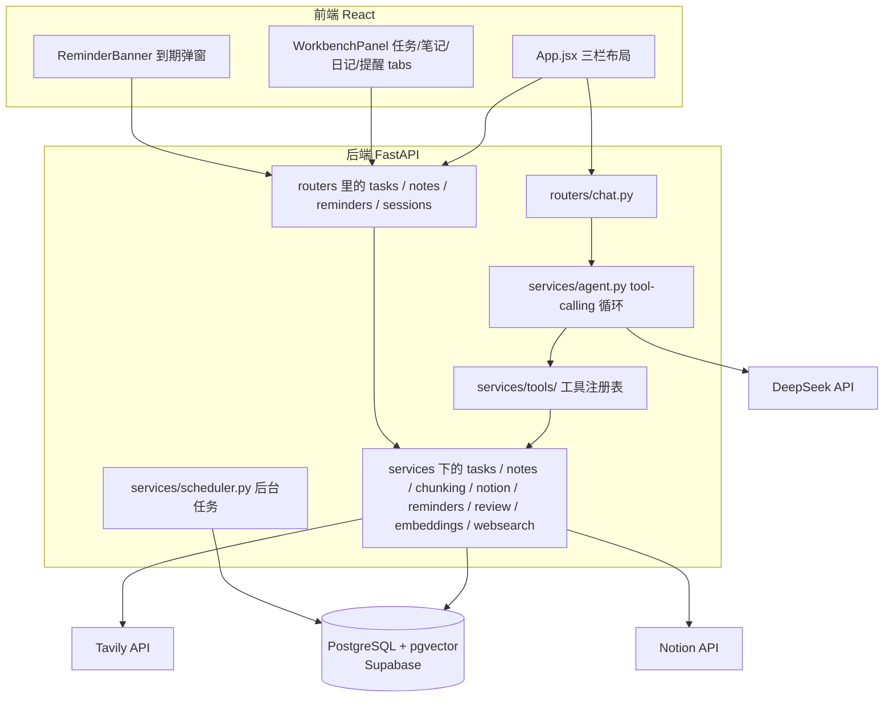

# AI-Chat 技术架构文档

面向项目维护者本人，以及未来接手这个仓库的其他人或 AI。目标是不用通读全部源码，看完这一篇就能理解整体架构、每个文件的职责、怎么加新功能。

## 1. 项目是什么

一个基于 DeepSeek API 的个人工作台 agent 平台。表面上是个聊天应用，但聊天只是入口，背后是任务管理、笔记知识库（语义检索）、日记复盘、日程提醒、联网搜索几个模块，AI 通过 function calling 真实地操作这些模块的数据，而不是纯文本问答。

项目是分阶段演进的，理解代码时有用：最初是纯聊天机器人，只做多轮对话和历史记录；之后加固了安全和工程基础，包括 CORS 白名单、API Key 鉴权、把同步数据库调用改成异步、迁移掉已弃用的模型名；再之后改造成 agent 平台，先搭好核心的 tool-calling 循环，再分五个阶段依次接入任务、笔记、日记、提醒、联网搜索。

## 2. 技术栈总览

| 层 | 技术 | 说明 |
|---|---|---|
| 后端框架 | FastAPI | 全异步路由 |
| ASGI Server | Uvicorn | |
| ORM | SQLAlchemy 2.0 | 用的是异步扩展 sqlalchemy.ext.asyncio |
| 数据库驱动 | asyncpg | PostgreSQL 的异步驱动 |
| 数据库 | PostgreSQL，托管在 Supabase | 原计划本地 Docker 跑，Docker Desktop 起不来后改用 Supabase 免费云端实例 |
| 数据库迁移 | Alembic | 表结构变更走 autogenerate + upgrade，不再手动建表或者删库重建 |
| LLM | DeepSeek API，deepseek-flash 模型 | 走 OpenAI SDK 兼容协议，AsyncOpenAI 指向 DeepSeek 的 base_url |
| Embedding | fastembed，本地 ONNX 模型 BAAI/bge-small-zh-v1.5，512 维 | 不依赖外部 embedding API |
| 向量检索 | pgvector，HNSW 索引 + 余弦距离 | 检索在数据库端完成，不再是 Python 里手写循环 |
| 后台调度 | APScheduler | AsyncIOScheduler，负责提醒到期扫描 |
| 联网搜索 | Tavily REST API | 用 httpx 直接调用，没有引入官方 SDK |
| Notion 同步 | Notion REST API，版本头 2025-09-03 | 用 httpx 直连，只读导入，没有引入官方 SDK |
| 前端框架 | React 19 + Vite 8 | 没用状态管理库，纯 useState 和 props |
| Markdown 渲染 | react-markdown | 渲染 AI 回复 |
| 部署 | Railway 跑后端，Vercel 跑前端 | |
| Python 版本 | 3.11 | 曾经用的是 Anaconda 全局 3.8，因为 fastembed 依赖的 onnxruntime 需要 3.10 以上而升级 |

## 3. 系统架构



一次带工具调用的对话请求，完整链路是这样的（以 /api/chat/stream 为例）：

前端发送 POST 请求，带 X-API-Key 请求头。后端先由 auth 依赖校验这个 key。routers/chat.py 把用户消息存库，拼装 system prompt（里面包含当前时间）加上历史消息。接着 services/agent.py 里的 run_agent 进入循环：调用 DeepSeek 的 chat completions 接口并带上 tools 参数，如果模型返回 tool_calls，就执行对应工具（在 services/tools/ 里查表分发到 tasks、notes、notion、reminders、review、websearch 几个模块），把执行结果塞回对话继续问，直到模型不再要求调用工具为止。这中间每一步，无论是工具调用、工具结果还是最终回复，都会写进 agent_traces 表，用于事后追溯。

拿到最终文本后，chat.py 会把它切成小块、带小延迟依次吐给前端，模拟打字机效果。这里要注意，这不是真正的 token 级流式，因为工具调用阶段没法边调用边流式吐字，所以实际是整体生成完再回放。响应头里带着 X-Session-Id（新会话的 id）和 X-Tool-Used（这一轮有没有调用过工具），前端用后者决定要不要刷新工作台面板。

## 4. 目录结构与文件职责

```
AI-Chat/
├── main.py               FastAPI 入口：CORS 白名单、lifespan（确保 pgvector 扩展存在、启动调度器）、挂路由
├── database.py           所有 SQLAlchemy 模型，以及异步 engine/session 工厂
├── alembic.ini           Alembic 配置，数据库连接串从 DATABASE_URL 环境变量读
├── migrations/           Alembic 迁移脚本，env.py 接了项目的 Base.metadata 和异步引擎
├── requirements.txt      后端依赖，注意 numpy 和 onnxruntime 的版本是钉住的，见第 14 节
├── .python-version       3.11，配合 Railway 部署用
├── vercel.json           让 Vercel 在这个 monorepo 里正确构建 frontend 子目录
├── railway.toml          Railway 启动命令
│
├── routers/              只负责解析请求、调用 services、序列化响应，不写业务逻辑
│   ├── chat.py             对话入口，system prompt 在这里拼
│   ├── sessions.py         会话和消息历史查询
│   ├── tasks.py            任务的 REST 接口
│   ├── notes.py            笔记和日记的 REST 接口，含语义搜索和 Notion 同步
│   └── reminders.py        提醒的 REST 接口
│
├── services/              业务逻辑层，REST 路由和 agent 工具共用同一套函数，不会重复实现
│   ├── auth.py              X-API-Key 鉴权依赖，自己调用 load_dotenv，不依赖别的模块先加载 .env
│   ├── llm.py               DeepSeek 客户端封装
│   ├── agent.py             核心的 tool-calling 循环，写 agent_traces，是整个项目最关键的一个文件
│   ├── tools/               工具注册表，按模块拆成几个文件，__init__.py 汇总成 TOOL_SCHEMAS/TOOL_HANDLERS
│   │   ├── tasks_tools.py     任务相关工具
│   │   ├── notes_tools.py     笔记/日记/Notion 同步相关工具
│   │   ├── reminders_tools.py 提醒相关工具
│   │   └── websearch_tools.py 联网搜索工具
│   ├── tasks.py             任务的增删改查，纯数据库操作，不调用 LLM
│   ├── notes/               笔记 / RAG 这一摊都在这个包里，对外仍是 from services import notes as notes_service
│   │   ├── notes.py           笔记和日记的增删改查，分块写入和语义检索，外部来源笔记的 upsert
│   │   ├── chunking.py        正文分块的纯函数，不依赖数据库，可以单独测试
│   │   ├── embeddings.py      fastembed 封装，推理放在线程池里跑，不阻塞事件循环，支持批量
│   │   └── notion.py          Notion 只读同步：拉页面和正文、增量判断、限流重试
│   ├── review.py            周复盘数据聚合，只出数据不调 LLM，总结文字交给 agent 自己写
│   ├── reminders.py         提醒的增删改查，以及供调度器调用的到期检查
│   ├── scheduler.py         APScheduler 封装，每 60 秒跑一次到期扫描
│   └── websearch.py         Tavily 封装，没配 key 时优雅返回错误提示，不会抛异常
│
└── frontend/              React + Vite，见第 11 节
```

## 5. 核心机制：Agent Tool-Calling 循环

run_agent 函数（在 services/agent.py 里）的逻辑大致是这样：

设一个最大步数上限（目前是 5），防止死循环。每一步先调用 DeepSeek 接口。如果模型返回的消息里没有 tool_calls，说明它给出了最终回复，循环结束，把这段文字返回。如果有 tool_calls，就依次找到每个工具对应的处理函数、执行、把结果按 OpenAI 的 tool 消息格式塞回对话历史，然后进入下一轮循环，继续问模型。

设计上有几个值得记住的点。工具是服务层的薄包装，tools.py 里的处理函数只是调用 tasks.py 这些模块里的普通函数，REST 路由也调用同一套函数，所以聊天里能做的事和界面上能做的事逻辑不会分叉。工具本身是"哑"的，不会自己调用 LLM，比如 get_weekly_review 只返回结构化数据，总结文字是外层循环里模型自己生成的，这样工具保持确定性，也方便单独测试。system prompt 里会注入当前时间，否则模型没法把"明天""5 分钟后"这种相对时间换算准确。最后，流式接口不是真流式，原因前面第 3 节已经说过。

## 6. 数据模型

数据库定义都在 database.py 里，用的是 PostgreSQL（托管在 Supabase）。

sessions 表存一次对话会话，字段有标题和创建时间。messages 表存每条原始消息，关联到某个 session，agent 内部的工具调用过程不存在这里，那些存在 agent_traces 里。tasks 表是任务/待办，包含标题、完成状态、可选的截止时间。notes 表比较特殊，笔记和日记复用同一张表，靠 category 字段区分是 note 还是 journal，另外 source 字段区分来源（local 或 notion），external_id 存 Notion 页面 id，external_updated_at 存 Notion 那边的最后编辑时间（UTC），增量同步靠它判断页面有没有改过。note_chunks 表存笔记的分块，每个分块一行，带 pgvector 原生的向量列（512 维，对应 fastembed 生成的向量）和 HNSW 索引，外键指向 notes 并且级联删除，删笔记时分块自动清理。所有检索都在这张表上做，不在 notes 上。reminders 表存提醒，fired 字段由后台调度任务在到期后置为真，前端据此弹提示。agent_traces 表记录每轮对话内 agent 的完整执行轨迹，包括工具调用、工具结果、最终回复三种类型，是可观测性的落地。

表结构变更走 Alembic：改 database.py 里的 model，跑 alembic revision --autogenerate 生成迁移文件，检查一遍生成的内容，再 alembic upgrade head 应用。有个已知的坑：涉及向量列的迁移，autogenerate 生成的文件里会漏掉 import pgvector.sqlalchemy，需要手动补上，不然跑迁移会报 NameError。

笔记检索的设计是这样：embedding 模型只能处理约 512 个 token，长笔记不分块的话，后半段永远检索不到。所以写入笔记时先用 services/notes/chunking.py 切块，按段落合并到约 400 字一块，遇到标题行就另起一块，单个超长段落硬切并重叠 50 字；算向量时每块前面带上笔记标题；同一条笔记的所有分块批量送进模型。检索时在 note_chunks 上按余弦距离取最近的 top_k 乘 4 个分块，再按笔记去重，每条笔记只保留得分最高的那一块，最后取前 top_k 条。已知限制是按分类过滤发生在近似最近邻查找之后，过滤后结果可能少于要求的数量。另外 bge-small-zh 的相似度分数区间比较窄，不相关的短文本也能拿到 0.3 到 0.4，所以分数只适合排序，不适合设绝对阈值。

Notion 同步（services/notes/notion.py）是只读导入：先通过数据库 id 拿到 data source，再分页查出所有页面，对每个页面比较 last_edited_time 和本地的 external_updated_at，没改过就跳过，不拉正文也不重新算向量；改过或者是新页面就拉正文，正文抓取覆盖段落、标题、列表、引用、待办、代码块、折叠块和表格，嵌套内容递归最多 3 层，图片和子页面跳过，然后调用 notes 服务的 upsert，重建这个页面的分块。每个页面单独提交，单个页面失败只计入失败数，不影响其他页面。页面列表完整读完之后，本地有、Notion 里已经查不到的页面（删了或移出了数据库）对应的笔记会被删除，计入删除数；读取中途出错时不会执行这一步，不会误删。遇到 429 限流按 Retry-After 等待，最多重试 3 次。Notion 来源的笔记在本地是只读的，删除接口返回 403，因为本地删掉的话下次同步会被重新导入。

## 7. Agent 工具清单

按模块拆在 services/tools/ 目录下几个文件里，每个文件是自己模块的 TOOLS 列表，services/tools/__init__.py 汇总。

任务相关：create_task 建任务，list_tasks 按状态查任务，complete_task 标记完成，delete_task 删除。

笔记相关：save_note 存一条笔记，自动分块并算向量，search_notes 做语义检索，sync_notion_notes 把 Notion 数据库里的页面同步进来，返回新增、更新、跳过、失败、删除的数量。

日记相关：add_journal_entry 记一条日记，标题会自动生成成"日记 加日期"的格式；get_weekly_review 拿近 7 天任务、日记、笔记的聚合数据，本身不生成总结。

提醒相关：set_reminder 设置提醒，list_reminders 查询所有提醒，cancel_reminder 取消。

搜索：web_search 调用 Tavily 联网搜索，没配置 key 的时候会返回一条错误提示而不是让整个流程崩掉。

## 8. REST API 一览

除了 /api/chat 和 /api/chat/stream 之外，其余接口主要是给前端直接操作数据用的，不经过 agent。所有接口都需要 X-API-Key 请求头。

对话相关：POST /api/chat 是非流式对话，返回内容包含 session_id、reply 和 trace；POST /api/chat/stream 是流式对话，响应头里带 X-Session-Id 和 X-Tool-Used。

会话相关：GET /api/sessions 拿会话列表，GET /api/sessions/{id}/messages 拿某个会话的历史消息。

任务相关：GET 和 POST /api/tasks 分别是列表和新建，PATCH /api/tasks/{id}/complete 标记完成，DELETE /api/tasks/{id} 删除。

笔记相关：GET 和 POST /api/notes 支持用 category 参数区分笔记还是日记，GET /api/notes/search 做语义搜索，支持 query、top_k、category 参数，POST /api/notes/sync-notion 触发 Notion 同步，DELETE /api/notes/{id} 删除，遇到 Notion 来源的笔记返回 403。笔记的返回结构里带 source 字段。

提醒相关：GET 和 POST /api/reminders 是列表和新建，GET /api/reminders/due 拿已经到期的提醒，前端轮询用这个接口，DELETE /api/reminders/{id} 取消或者说是 dismiss。

## 9. 鉴权与安全

所有 /api 下的路由都挂了鉴权依赖，校验请求头里的 X-API-Key 是否等于环境变量 API_KEY。需要注意的是，如果没设置 API_KEY 环境变量，鉴权会直接放行，这是为了方便本地开发，生产环境一定要设置这个变量。

还有一点很重要：前端拿到的 key 不是真正意义上的密钥，因为 Vite 打包时会把 VITE_ 开头的环境变量直接编译进最终的 JS 文件，浏览器 devtools 能直接看到明文。这层鉴权只能挡住随手滥用和扫描器，挡不住真想扒接口的人。要真正防止 API 被刷，还需要加限流，目前项目里还没做。

跨域方面，main.py 里配置了白名单，默认只允许本地开发地址和线上 Vercel 域名跨域访问，可以用 ALLOWED_ORIGINS 环境变量（逗号分隔）覆盖默认值。

## 10. 环境变量

后端的 .env 文件（已经加入 gitignore）需要这几个变量：DEEPSEEK_API_KEY 是必须的；DATABASE_URL 是必须的，指向 PostgreSQL 实例（现在用的是 Supabase 的 Session pooler 连接串，格式是 postgresql+asyncpg://...），本地开发和线上环境都需要配；API_KEY 建议设置，是前后端之间简单鉴权用的 key；ALLOWED_ORIGINS 可选，不设的话用代码里写死的默认值；TAVILY_API_KEY 可选，不设置的话联网搜索这个工具会返回未配置的错误提示，不影响其他功能。

前端对应有自己的 .env 文件，只需要一个 VITE_API_KEY，必须和后端的 API_KEY 保持一致。

## 11. 前端结构

入口是 main.jsx，挂载 App 组件。App.jsx 是顶层布局，左边是会话侧栏，中间是聊天区，右边是工作台面板，顶部还有一条到期提醒的弹窗。api.js 导出后端地址和鉴权请求头，所有组件都从这里引用。theme.js 存了一些共享的颜色、输入框、按钮的内联样式常量，项目没有引入 CSS 框架，全部是内联样式。

组件目录下，WorkbenchPanel 是右侧面板的 tab 容器，负责在任务、笔记、日记、提醒四个 tab 之间切换。TaskPanel 是任务 tab 的内容，负责增删改。NotePanel 笔记和日记共用，靠传进去的 category 区分，里面有语义搜索框；笔记分类下有"同步 Notion"按钮，结果显示在按钮下方一行，Notion 来源的笔记标题旁有灰色的 Notion 小标签，并且不显示删除按钮；笔记正文默认折叠成 3 到 4 行，内容溢出时才出现"展开"，是否溢出靠实际测量，聊天面板收起、窗口变宽时会重新测。ReminderPanel 是提醒的管理界面，能看列表、手动创建、取消。ReminderBanner 是顶部到期提醒的弹窗，会轮询到期接口。

状态管理上没有引入 Redux 或者 Zustand，全靠 useState 和 props 一层层传下去。App.jsx 里有个叫 workbenchRefreshKey 的计数器，agent 用过工具之后就加一，通过 props 传给各个面板，让它们重新拉一次数据，这是让"聊天里改的数据"和"面板上看到的数据"保持一致的机制。

前端这部分代码是通过 git subtree 从一个独立仓库合并进来的，保留了原始的提交历史，原来那个独立仓库现在已经加了归档说明，不再单独维护。

## 12. 本地开发

后端需要 Python 3.10 以上，还需要一个能连上的 PostgreSQL（推荐直接用 Supabase 免费实例，注册后把连接串填进 DATABASE_URL 就行，不需要本地装数据库）。建虚拟环境、装依赖、配好 .env 里的几个变量、跑一次 alembic upgrade head 建表，之后用 uvicorn 启动。前端进 frontend 目录，npm install，配好 .env 里的 VITE_API_KEY，然后 npm run dev。具体命令可以直接看仓库根目录的 README。

## 13. 部署

后端部署在 Railway 上，railway.toml 里指定了启动命令。需要在 Railway 项目设置里配好 .env 里那几个环境变量，并且确认用的是 Python 3.11。

前端部署在 Vercel 上，因为仓库是个 monorepo，前端代码在 frontend 子目录下，所以在仓库根目录放了个 vercel.json，显式指定了进 frontend 目录安装和构建的命令，这样就不用依赖 Vercel 项目设置里的 Root Directory 配置也能正常构建。

## 14. 已知限制和技术债

onnxruntime 目前钉死在 1.17.3 版本，同时要求 numpy 低于 2.0，这是刻意为之。更高版本的 onnxruntime 在开发机上和 numpy 2.x 之间有 ABI 层面的冲突，会直接导致进程崩溃，不是普通的 Python 异常。以后升级这两个包之前，务必先确认组合仍然兼容。

流式接口是伪流式，前面已经解释过原因，工具调用阶段对用户来说是完全不可见的，只能干等。

会话列表和笔记列表这些接口都是全量返回，没有做分页，数据量大了会慢。

项目里没有自动化测试，所有验证都是手动用 curl 或者浏览器测过的。

这是个单用户设计，没有多用户或者多租户的概念，API_KEY 是所有人共用的一把钥匙。

web_search 工具返回的网页内容没有做任何 prompt injection 方面的防护，如果搜到的网页里藏着诱导模型忽略指令的内容，理论上是有被注入的风险的，目前没有针对性处理。

提醒的到期通知只有前端轮询弹窗这一种方式，没有推送、邮件或者短信，用户必须开着页面才能看到提醒。

本地开发依赖能连上 Supabase 的网络，断网就没法开发，这是当初 Docker 起不来临时改用云端数据库带来的副作用，本机 Docker/WSL2 环境修好之后可以考虑改回本地跑。

## 15. 可能的后续方向

值得考虑的方向包括：做多 agent 编排，比如用一个 router agent 把任务分发给专门的子 agent；搭一套评测 harness，用一组测试 prompt 加预期的工具调用去自动化跑分；加限流防止 API 被刷；Notion 同步目前只能手动触发，可以加一个定时任务自动同步（spec 见 docs/specs/notion-sync.md）。
